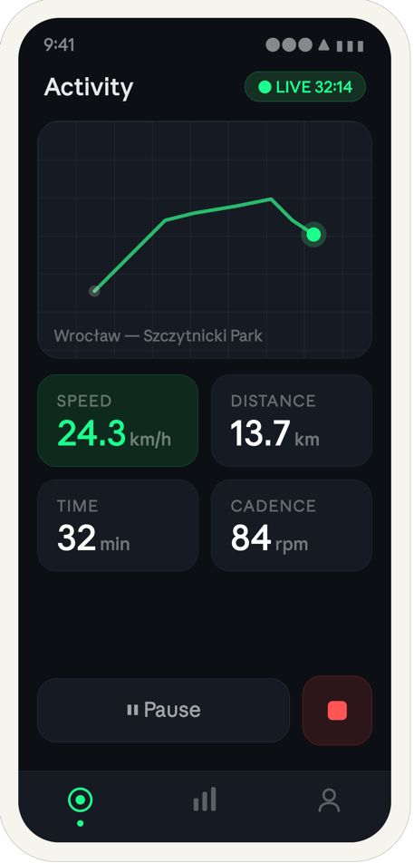
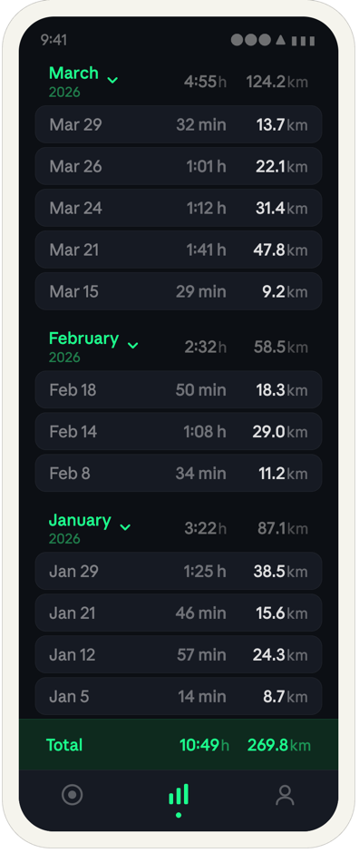
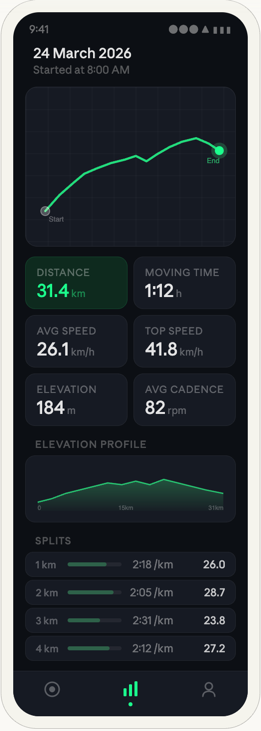
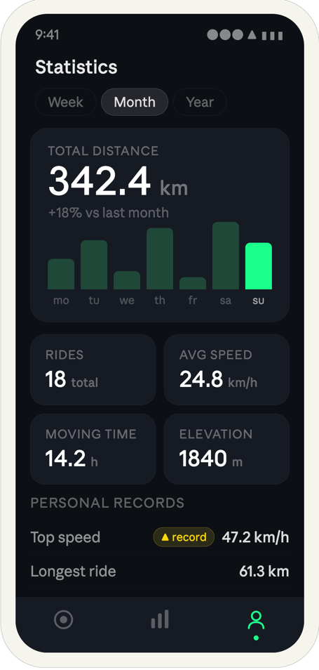

# Bike Tracker — Product Specification

**Version:** 1.0  
**Platform:** Android (Flutter)  
**Storage:** Local only (SQLite)  
**Maps:** OpenStreetMap (no API key required)

---

## Overview

Bike Tracker is a lightweight Android application for recording and reviewing cycling activities. 
All data is stored on-device with no server interaction. 
The app focuses on three core experiences: live ride tracking, browsing past rides, and reviewing personal statistics.

- Screen 1 — Activity
  Live tracking screen. Shows a mini map with the current route trace, four real-time metrics (speed, distance, time), a pause button, and a stop button. A green "LIVE" badge indicates an active session.
- Screen 2.1 — History
  List of past rides filtered by month. Each entry shows a ride name, date/time, distance, average speed, and duration.
- Screen 2.2 — History Details
  Each entry shows the ride details.
- Screen 3 — Statistics
  Aggregated data per week/month/year. Hero card shows total distance with a weekly activity bar chart. Below are four metric cards (rides, avg speed, moving time, elevation), followed by a personal records section.
---

## Navigation

A persistent bottom tab bar provides access to all three main screens. The active tab is highlighted in green. Tabs from left to right:

| Tab        | Icon              | Description                     |
|------------|-------------------|---------------------------------|
| Activity   | Crosshair / radar | Live tracking and ride controls |
| History    | Bar chart         | List of past rides              |
| Statistics | Profile / person  | Aggregated personal stats       |

---

## Screen 1 — Activity

> Ride tracking screen. Shows current location on the map immediately on open, even before a ride starts.

### Header

- Title: **Activity** (left-aligned)
- Live badge (top right): green dot + "LIVE" label + elapsed time (e.g. `32:14`). The dot pulses to indicate an active GPS session.

### Map Area

- The map centers on the user's current GPS position as soon as the screen opens, before any ride is started. Position updates continuously while the user is moving.
- Once a ride is active, the current route trace is drawn as a green polyline.
- The rider's current position is shown as a green filled circle with a subtle halo at all times (idle, active, and paused).

### Metric Cards

Four cards arranged in a 2×2 grid:

| Card     | Value                    | Unit    |
|----------|--------------------------|---------|
| Speed    | Current speed            | km/h    |
| Distance | Total distance this ride | km      |
| Time     | Elapsed time             | min / h |
| Altitude | Current GPS altitude     | m       |

The **Speed** card is highlighted in green when the rider is moving.

### Controls

- **Pause button** (wide): pauses GPS recording; label switches to "Resume" when paused.
- **Stop button** (square, red): ends the session and saves the ride to history. Confirmation is required.

---

## Screen 2.1 — History

> Chronological list of completed rides, filterable by month.

## Screen: History

The History screen displays a complete chronological log of all recorded rides,
grouped by month. There is no header or title — the list begins immediately
below the system status bar.

---

### Monthly sections

Rides are organized into collapsible monthly sections. Each section header is a
tappable row that toggles the visibility of that month's rides. The header row
uses the same four-column grid as the ride rows beneath it: month name and year
on the left, total duration in the second column, total distance in the third
column.

The month name is displayed at 12 dp, weight 500, in the primary green color.
The year is displayed on a second line below the month name at 10 dp, weight
400, in a muted green at reduced opacity. A small chevron arrow sits immediately
to the right of the month name and rotates 90° when the section is expanded.
The monthly totals use the same 12 dp, weight 500 style as the individual ride
values, rendered in muted white.

---

### Ride rows

Each ride is displayed as a single compact row with a surface background, 8 dp
border radius, and a subtle border. The row uses a four-column grid layout:
date on the left, a small gap column, duration in the center-right column, and
distance in the rightmost column.

The date is formatted as abbreviated month and day (e.g. "Mar 29"), rendered at
12 dp in muted white. The duration is rendered at 12 dp in a dimmer muted white
(e.g. "32 min" or "1:01 h"). The distance value is rendered at 12 dp, weight
500, in a brighter white to draw visual emphasis, followed by a muted "km" unit
suffix at 11 dp. Vertical padding per row is 6 dp.

---

### Column alignment

The date column, duration column, gap column, and distance column are consistent
across all rows and section headers, creating continuous vertical alignment
throughout the entire list.

| Column   | Width  |
|----------|--------|
| Date     | 1fr    |
| Duration | 52 px  |
| Gap      | 8 px   |
| Distance | 52 px  |

---

### Collapsed state

When a section is collapsed, its ride rows are hidden with an animated
transition. Only the section header remains visible, still showing the monthly
totals. The chevron rotates to indicate the collapsed state.

---

### Total bar

A pinned row is fixed at the bottom of the list, above the navigation bar. It
uses the same four-column grid and displays the label "Total" on the left and
the all-time totals for duration and distance on the right.

| Property         | Value                          |
|------------------|--------------------------------|
| Background       | `#0D2A1E`                      |
| Top border       | `0.5px solid #1AFF8C33`        |
| Text color       | Primary green `#1AFF8C`        |
| Font size        | 12 dp, weight 500              |
| Unit suffix      | 11 dp, `rgba(26,255,140,0.5)`  |

---

### Bottom navigation

The standard three-tab bottom navigation bar is always visible. The History tab
is active on this screen, indicated by green icons and a small green dot
indicator below the active tab icon.

### Ride Detail (tap-through)

A secondary screen accessible by tapping any ride in the list:

- Full-screen map with the complete route polyline.
- Elevation profile chart (if elevation data is available).
- Complete metrics: distance, avg speed, max speed, duration, elevation gain.
- Option to rename or delete the ride.

---

## Screen 2.2: Ride Detail

> Accessed by tapping any ride row in the History screen.

---

### Header

The header displays two lines of text, left-aligned, with no interactive
elements. The first line shows the full date of the ride formatted as
`DD Month YYYY` (e.g. "24 March 2026"), rendered at 14 dp, weight 500. The
second line shows the ride start time formatted as "Started at H:MM AM/PM",
rendered at 11 dp in muted text color.

---

### Map panel

A full-width map panel sits directly below the header, with 12 dp horizontal
margins and a 12 dp border radius, 160 dp tall. It displays the GPS route as a
polyline rendered in the primary green color. A muted white circle marks the
start point; a filled green circle with a soft glow ring marks the end point.
Small "Start" and "End" labels appear near the respective markers. The map is
non-interactive on this screen — no panning or zooming.

---

### Metric cards

A 2×2 grid of metric cards sits below the map, with 12 dp horizontal padding
and 6 dp gaps. Each card has a 10 dp muted uppercase label and an 18 dp numeric
value with a unit suffix.

| Order | Metric         | Notes                                               |
|-------|----------------|-----------------------------------------------------|
| 1     | Distance       | Accented card — `primary-bg` background, green text |
| 2     | Moving time    |                                                     |
| 3     | Avg speed      |                                                     |
| 4     | Top speed      |                                                     |
| 5     | Elevation gain |                                                     |

---

### Elevation profile

A section labeled "ELEVATION PROFILE" in a small muted uppercase label precedes
a chart panel. The panel uses the same surface background and border as the
metric cards. The chart is a filled area line chart showing altitude in metres
on the Y axis and distance in kilometres on the X axis. The fill uses a
top-to-transparent green gradient. Three axis labels are shown at the bottom:
start (0), midpoint, and end distance.

---

### Splits table

A section labeled "SPLITS" precedes a list of per-kilometre rows. Each row is
laid out on a four-column grid.

| Column       | Content                                                       |
|--------------|---------------------------------------------------------------|
| Left         | Kilometre index (e.g. "1 km")                                 |
| Center       | Proportional speed bar — fill width relative to fastest split |
| Center-right | Pace in min/km (e.g. "2:18 /km")                              |
| Right        | Speed in km/h (e.g. "26.0")                                   |

Rows use the same surface card style as the rest of the screen: `#161A23`
background, 8 dp border radius, 0.5 px subtle border.

---

### Bottom navigation

The standard three-tab bottom navigation bar is present and unchanged. The
History tab remains active while this screen is open, as it sits within the
History navigation stack.

## Screen 3 — Statistics

> Aggregated performance data for a selected time period.

### Period Selector

Three toggle pills: **Week · Month · Year**. Active period is shown with a white filled pill. All data below updates when the period changes.

### Hero Card — Total Distance

- Large label: **TOTAL DISTANCE**
- Hero number: total km ridden in the selected period (e.g. `342.4 km`).
- Sub-label: percentage change vs the previous equivalent period (e.g. `+18% vs last month`), colored green for improvement, red for decline.
- **Bar chart**: weekly activity breakdown (mo–su). Each bar represents distance for that day. The current day's bar is highlighted in bright green; past days use a muted green.

### Metric Cards

Four cards in a 2×2 grid:

| Card        | Metric                          |
|-------------|---------------------------------|
| Rides       | Total number of rides in period |
| Avg Speed   | Average speed across all rides  |
| Moving Time | Total time spent riding         |
| Elevation   | Total elevation gained          |

### Personal Records

A flat list below the metric cards. Each row shows:

- Record name (e.g. "Top speed", "Longest ride")
- A yellow **▲ record** badge when the current period produced a new personal best
- The record value (e.g. `47.2 km/h`, `61.3 km`)

---

## Data Model

Each ride stores the following:

| Field          | Description                                   |
|----------------|-----------------------------------------------|
| Name           | Auto-generated or user-edited label           |
| Date & time    | Start timestamp                               |
| Total distance | km, calculated from GPS points                |
| Average speed  | km/h                                          |
| Max speed      | km/h                                          |
| Duration       | Total elapsed time                            |
| Moving time    | Time excluding pauses                         |
| Elevation gain | Meters climbed                                |
| Track points   | GPS coordinates + speed + timestamp per point |

---

## Key Design Principles

- **Dark theme only.** Background is near-black (`#0f0f0f`), surfaces use a slightly lighter dark card. Green (`#34d367`) is the single accent color used for active states, CTAs, and live indicators.
- **Minimal chrome.** No unnecessary chrome, ads, accounts, or network calls.
- **Local first.** No data leaves the device. No analytics, no crash reporting unless explicitly added by the developer.
- **Light APK.** Target under 20 MB. OSM tiles are cached on demand, not bundled.

---

## Out of Scope
- Social features or ride sharing
- Cloud sync or backup
- Third-party integrations (Strava, Garmin, etc.)
- Turn-by-turn navigation
- Heart rate monitor support (cadence sensor is optional BLE)
- iOS support